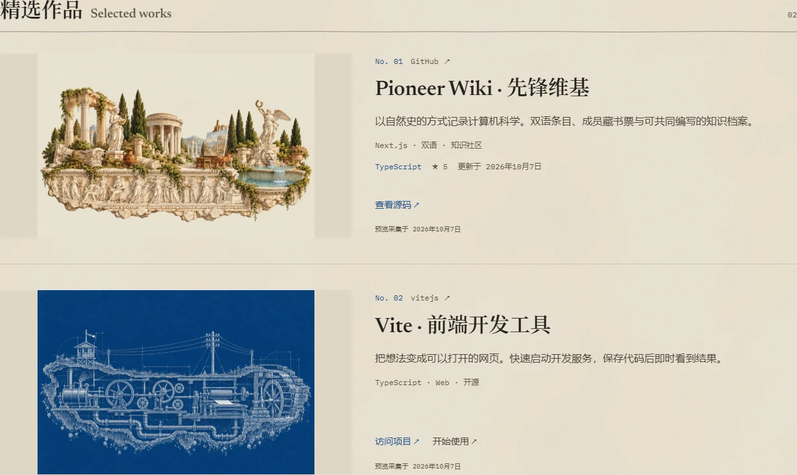

# 精选作品 / Selected works

成员主页的「精选作品」把项目的介绍、预览画面和外部入口放在一起。
可以添加 GitHub 仓库，也可以添加网站、演示、文章等其他公开作品。
原来的「别处」链接和 GitHub「工坊」继续保留。

## 使用

1. 在自己的主页进入「编辑我的主页」，找到「精选作品」。
2. 从 GitHub 工坊选入仓库，或添加作品并输入主地址。
3. 点击「读取／刷新预览」导入公开分享信息，再填写自己的介绍、图片地址、标签和补充入口。
4. 用上移、下移按钮安排顺序，点击「保存主页」公开本次修改。

最多 8 件作品；每件最多 8 个标签、4 条补充链接。名称和简介留空时使用导入的预览；
手动填写的内容优先，刷新预览不会改写它们。GitHub 仓库的公开网站地址也会作为体验入口显示。
导入预览只修改当前编辑状态，不会单独保存或发布。

## 预览与持久化

- 网站预览是保存的快照，需要本人主动刷新；公开主页不会自动抓取任意网站。
- GitHub 公开数据缓存一小时。读取失败时保留保存的快照；图片加载失败时显示项目名称与来源。
- 图片由浏览器直接从来源加载，不经服务器图片代理、不下载入仓库。只使用允许展示的图片。
- 网站抓取仅本人可用，支持公开 HTTP(S) 默认端口，限制 DNS 目标、重定向、大小与时间，不执行脚本或携带登录信息。
- 使用 Supabase 时，先应用 `supabase/migrations/202610100001_member_projects.sql`。该迁移只新增带空数组默认值的 JSONB 字段及数组长度约束，沿用现有成员编辑权限。
- 旧记录仍可读取。部署顺序为先迁移、后应用；回退应用代码可以保留字段与已保存作品。删除字段会丢失作品数据，应先导出备份。
- Mock 后端的作品和其他编辑数据一样，只在开发服务进程内保存，重启后恢复 fixtures。

如果本机代理 DNS 把公网域名映射为 `198.18.*` 等保留地址，抓取会拒绝这类结果。
界面仍支持手动保存作品；使用正常公网 DNS 的服务端部署可导入公开网站。

## 展示示例

以下截图来自隔离的 Mock 开发服务，示例作品及图片覆盖没有写入生产或成员 fixtures。
画面展示手动选择封面后的效果；实际网站分享图与 GitHub 分享图也已在浏览器中验证加载。

[查看移动端截图](screenshots/member-projects-mobile.webp)

截图中的示例封面复用 `public/stage/art.webp` 与 `public/stage/blueprint.webp`，
署名 **Pioneer Wiki · 先锋维基 (github.com/puresky271)**，CC BY 4.0。
截图按 CC BY 4.0 提供，参见 [插画许可](../LICENSE-ILLUSTRATIONS.md)；未提交第三方分享图片。

## English

Members can curate up to eight selected works from GitHub or other public websites.
Each work combines a preview, an authored description, tags and up to four extra links.
Imports do not publish automatically, and authored fields always override imported information.
Website previews are saved snapshots; public GitHub data is cached for an hour, with saved content retained on failure.

Apply `202610100001_member_projects.sql` before deploying against Supabase. It adds the portfolio field without changing existing owner/admin permissions.
The screenshots above show an isolated mock page with repository-owned CC BY 4.0 sample covers; no third-party sharing images are redistributed.
